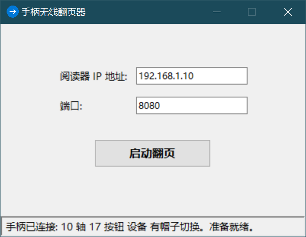
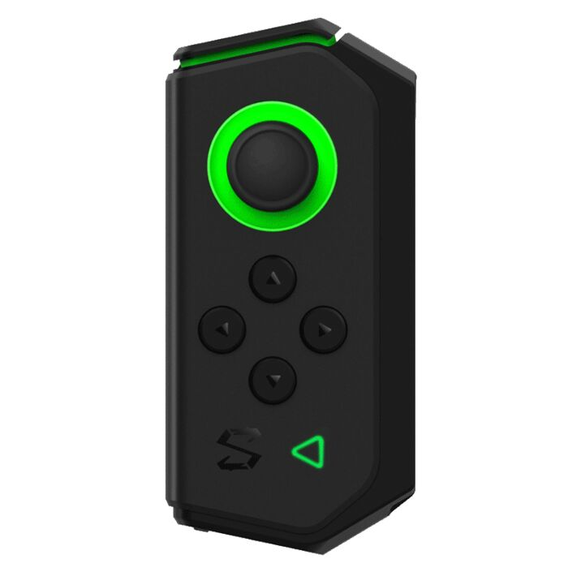

# 手柄无线翻页器 (Gamepad Turner)

一个专为 KOReader 设计的无线翻页应用程序，通过蓝牙游戏手柄控制电子书翻页。

## 📖 项目简介

手柄无线翻页器是一个 Python 桌面应用程序，允许用户使用已连接到 Windows 电脑的蓝牙游戏手柄（适配黑鲨双翼手柄L）来控制局域网内 KOReader 阅读器的翻页操作。通过 HTTP 调试接口实现无线翻页功能，特别适合在阅读时远程控制翻页。

## ✨ 主要特性

- 🎮 **手柄控制**: 支持黑鲨双翼手柄L及其他兼容游戏手柄
- 📱 **无线操作**: 通过蓝牙连接，实现远程翻页
- 🔄 **双向翻页**: 支持向前翻页和向后翻页
- 🖥️ **系统托盘**: 支持最小化到系统托盘运行
- ⚡ **低延迟**: 优化的轮询机制，响应迅速
- 🔧 **可配置**: 支持自定义 IP 地址和端口

## 🛠️ 技术栈

- **编程语言**: Python 3.x
- **GUI框架**: Tkinter
- **游戏手柄**: Pygame
- **HTTP请求**: Requests
- **系统托盘**: Pystray
- **图像处理**: Pillow (PIL)

## 📋 系统要求

- Windows 操作系统
- Python 3.7+
- 蓝牙游戏手柄（适配黑鲨双翼手柄L）
- KOReader 阅读器（需开启 HTTP 调试接口）

## 🚀 快速开始

### 安装依赖

```bash
pip install pygame pystray pillow requests
```

### 运行应用

```bash
python GamepadTurner.py
```

### 打包为可执行文件

```bash
# 使用 PyInstaller 打包
pyinstaller --onefile --windowed --icon=icon.ico GamepadTurner.py
```

## 🎯 使用说明

### 1. 连接手柄
- 确保蓝牙手柄已连接并配对
- 启动应用程序，程序会自动检测手柄连接状态

### 2. 配置 KOReader
- 在 KOReader 中启用 HTTP 调试接口
- 设置 IP 地址和端口（默认：192.168.1.10:8080）

### 3. 控制映射

| 手柄操作 | 翻页动作 |
|---------|----------|
| 按钮 10/11/7 | 向后翻页 |
| 按钮 5/8/9 | 向前翻页 |
| 摇杆轴 0/1 | 摇杆翻页 |

### 4. 系统托盘
- 点击最小化按钮可将程序隐藏到系统托盘
- 右键托盘图标可显示菜单选项
- 支持从托盘恢复窗口或退出应用

## 🎮 手柄适配

### 黑鲨双翼手柄L 按键映射

```
向后翻页按钮: 10, 11, 7
向前翻页按钮: 5, 8, 9
摇杆翻页轴: 0, 1
```

### 适配其他手柄

如需适配其他手柄，可在代码中修改以下配置：

```python
# 翻页按钮配置
NEXT_PAGE_BUTTONS = {10, 11, 7}      # 向后翻页按钮
PREV_PAGE_BUTTONS = {5, 8, 9}        # 向前翻页按钮

# 摇杆轴配置
NEXT_PAGE_AXES = {0, 1}              # 向后翻页摇杆轴
PREV_PAGE_AXES = {0, 1}              # 向前翻页摇杆轴

# 摇杆灵敏度
AXIS_THRESHOLD = 0.8                 # 摇杆触发阈值
```

## 📸 界面预览

### 软件界面

<!-- 软件界面截图位置 -->


### 手柄布局

<!-- 手柄截图位置 -->


## 🔧 配置说明

### KOReader HTTP 调试接口

确保 KOReader 已启用 HTTP 调试功能：

1. 打开 KOReader 设置
2. 进入 "网络服务" → "HTTP 服务"
3. 启用 HTTP 服务并设置端口
4. 记下设备的 IP 地址

### 应用程序配置

- **IP 地址**: KOReader 设备的 IP 地址
- **端口**: KOReader HTTP 服务端口（默认 8080）
- **冷却时间**: 翻页操作间隔（默认 0.4 秒）

## 🐛 故障排除

### 常见问题

1. **手柄未检测到**
   - 检查手柄是否已连接并配对
   - 重启应用程序
   - 确认手柄驱动正常

2. **无法连接到 KOReader**
   - 检查 IP 地址和端口是否正确
   - 确认 KOReader HTTP 服务已启用
   - 检查网络连接

3. **翻页无响应**
   - 检查手柄按键映射
   - 确认冷却时间设置
   - 查看应用程序状态栏信息

### 调试模式

如需调试，可查看控制台输出或修改日志级别。

## 📁 项目结构

```
GamepadTurner/
├── GamepadTurner.py      # 主程序文件
├── icon.ico              # 应用程序图标
├── README.md             # 项目说明文档
└── screenshots/          # 截图目录
    ├── software-interface.png
    └── gamepad-layout.png
```

## 🤝 贡献指南

欢迎提交 Issue 和 Pull Request 来改进这个项目！

## 📄 许可证

本项目采用 MIT 许可证。

## 🙏 致谢

- [KOReader](https://github.com/koreader/koreader) - 优秀的开源阅读器
- [Pygame](https://www.pygame.org/) - 游戏手柄支持
- [Pystray](https://github.com/moses-palmer/pystray) - 系统托盘功能

---

**注意**: 请确保在使用前正确配置 KOReader 的 HTTP 调试接口，并确保设备和应用程序在同一网络下。